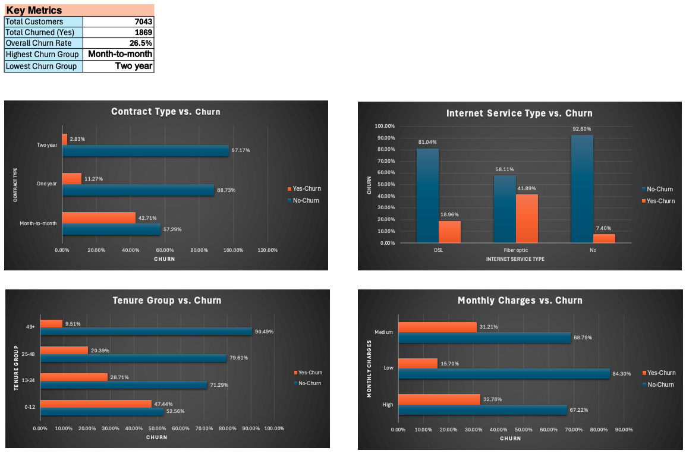

# telco-customer-churn-dashboard
📊 Telco Customer Churn Analysis – Excel Dashboard Project
This project explores customer churn trends using the Telco Customer Churn dataset. Built in Microsoft Excel, it includes data cleaning, exploratory analysis, and dashboard visualization to uncover churn patterns based on contract type, internet service, tenure, and charges.

**🖼️ Dashboard Preview:**
- For quick preview, see the attached PDF version of the dashboard

**💡 Key Features:**
- Cleaned and transformed real-world dataset using Excel functions and filters
- Created PivotTables and charts to identify churn-prone groups
- Designed a professional dashboard summarizing:
    - Churn by contract type
    - Tenure group patterns
    - Internet service impact on churn
    - Monthly charges vs churn
    - Calculated churn rate and customer counts
    - Used conditional formatting and layout design for clarity

**📁 Files Included:**
- Telco_Customer_Churn_Dashboard.xlsx
- Telco_Churn_Dashboard.pdf 

**🧰 Tools:**
Microsoft Excel (Mac)
PivotTables, Charts, Formulas
Conditional Formatting

**📌 Dataset:**
[Telco Customer Churn – Kaggle Source](https://www.kaggle.com/datasets/blastchar/telco-customer-churn)
